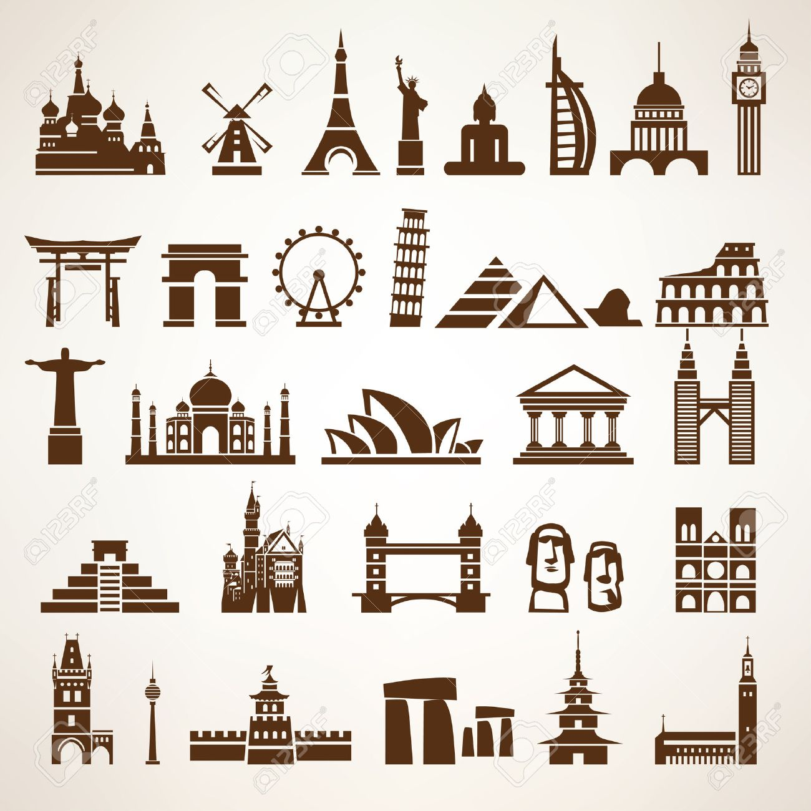

## 基于css的地标展示平台 ##

这是一个基于css的地标展示平台，

地标性建筑物的展示平台，

你想和你喜欢的人一起看这个世界最美的地方吗

你想让你的孩子在最小的时候

就知道这世界有这些地方吗

也许这个平台会给你想要的答案

#### 二、 过程图  

  <b>纯css3的`世界建筑物展示平台哦` </b>
    
  

#### 三、 设计稿  

  <b>线稿</b>
    
  
    
  
    
  
    
  <b>成品</b>
    
  悉尼歌剧院
    
  
    
  巴黎——埃菲尔铁塔
    
  
    
  还有相框
    
  

